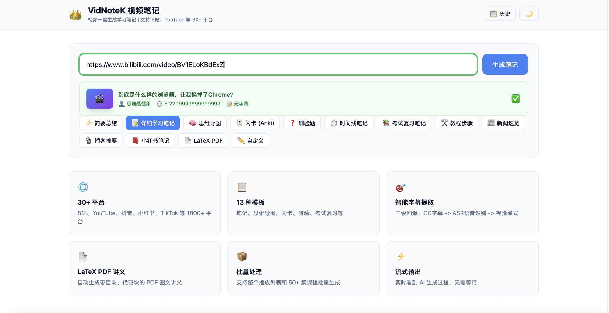
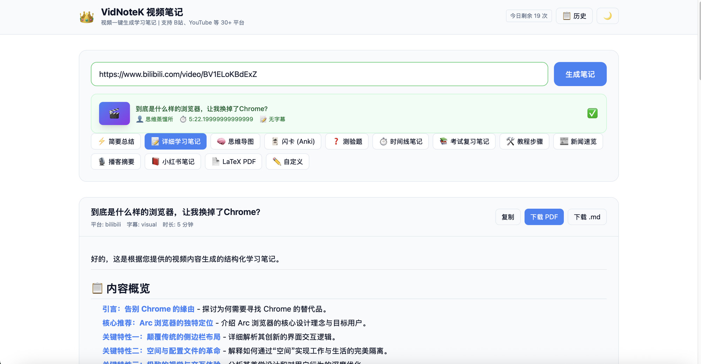

# VidNoteK - 视频笔记AI助手

> **一键把视频变成精美图文 PDF 讲义 —— 智能视频学习笔记工具**


## 这是什么？

你有没有遇到过这些情况：

- B站收藏了几十个课程合集，但根本没时间看？
- YouTube 上有很好的教程，但看视频效率太低？
- 想把一个 3 小时的课程变成可以打印、可以复习的讲义？

**VidNoteK** 就是来解决这些问题的。给它一个视频链接，它就能自动：

```
视频链接 → 下载视频 → 智能截取关键帧 → 提取字幕/语音 → AI生成笔记 → 输出精美PDF讲义
```

---

## 核心卖点：图文并茂的 PDF 讲义

这不是简单的"视频转文字"，而是 **带关键帧截图、结构化章节、高亮知识框** 的专业讲义：

| 功能 | 说明 |
|------|------|
| 🎯 智能关键帧提取 | 场景检测 + 信息密度评分 + 感知哈希去重，自动挑选最有价值的画面 |
| 📐 专业 LaTeX 排版 | tcolorbox 高亮框、代码高亮、数学公式、封面、目录、页眉页脚 |
| 📚 13 种输出模板 | 详细笔记、简要总结、思维导图、闪卡、测验题、考试复习、时间线…… |
| 🌍 30+ 平台支持 | B站、YouTube、抖音、小红书、快手、TikTok、Twitter 等 |
| 🔄 批量处理 | 整个课程合集（比如 26 集的课）一键全部处理 |
| 🔁 字幕三级回退 | 平台字幕 → Whisper ASR → 纯视觉模式 |

---

## 📸 产品截图

### 输入界面
粘贴视频链接，选择输出模板，一键生成


### 生成结果
支持 Markdown 预览、导出 PDF、一键复制


---


### 13 种模板功能介绍

#### 1. 详细笔记（`detailed`）—— 系统学习用

> 带完整目录、分章节、代码示例、数学公式的学习笔记

```
# MiniMind 第7集学习笔记：RMSNorm（理论）

## 目录
1. 层归一化概述
2. LayerNorm 详解
3. RMSNorm 详解
4. 数学推导与对比
5. 代码实现
```

#### 2. 简要总结（`brief`）—— 快速了解

> 3-5 段话概括整个视频核心内容

```
层归一化（Layer Normalization）是Transformer架构中稳定训练的关键技术。
RMSNorm移除了中心化操作，仅保留缩放操作，降低约7%-64%的计算开销。
公式：y = x / RMS(x) ⊙ g
```

#### 3. 思维导图（`mindmap`）—— 知识结构一目了然

```
# RMSNorm
## 层归一化基础原理
  - 定义：将一层神经元的输出进行标准化
  - 目的：稳定训练、加速收敛
## LayerNorm vs RMSNorm
  - LayerNorm：减均值 + 除标准差
  - RMSNorm：仅除以均方根
## 数学推导
  - RMS(x) = sqrt(1/n * Σxᵢ²)
```

#### 4. 闪卡 / Anki（`flashcard`）—— 间隔复习

```
Q1: 什么是层归一化(Layer Normalization)？
A1: 层归一化是一种归一化技术，对单个样本的所有特征进行归一化，
    使输出均值为0、方差为1。

Q2: RMSNorm 和 LayerNorm 的核心区别？
A2: RMSNorm 省略了均值计算（去中心化），只保留缩放操作。
```

#### 5. 测验题（`quiz`）—— 自测掌握程度

```
一、选择题（共7题，每题10分）

1. LayerNorm 计算过程中需要哪两个统计量？
   A. 均值和方差  B. 中位数和标准差  C. 最大值和最小值  D. 偏度和峰度
```

#### 6. 考试复习（`exam`）—— 公式速查 + 真题

```
核心概念速查表：
| 概念     | 定义                        | 关键特点         |
|----------|----------------------------|-----------------|
| LayerNorm | 对单个样本所有特征做归一化   | 计算均值μ和方差σ² |
| RMSNorm  | 仅使用均方根进行归一化       | 省略均值计算      |
```

#### 7. 时间线（`timeline`）—— 按时间戳整理

```
[00:00] 开场引入 - 本集内容概览
[00:30] 层归一化（LayerNorm）原理讲解
[01:15] RMSNorm 对比分析
[02:00] 数学推导
[03:30] 总结与下集预告
```

#### 8. 教程步骤（`tutorial`）—— 跟着做

```
Step 1: 理解层归一化基础原理
Step 2: 对比 LayerNorm 和 RMSNorm
Step 3: 手推 RMSNorm 公式
Step 4: 用 PyTorch 实现 RMSNorm
```

#### 9. 新闻简报（`news`）—— 媒体报道风格

```
MiniMind开源系列第7集发布：深入解析RMSNorm归一化技术

MiniMind项目于本周发布第7集技术教学视频，时长4分6秒，聚焦Transformer
架构中的核心归一化技术——RMSNorm。
```

#### 10. 播客摘要（`podcast`）—— 音频内容整理

```
🎙️ 播客风格摘要
时长: 4分6秒
主题: 层归一化原理与RMSNorm数学推导
```

#### 11. 小红书笔记（`xhs_note`）—— 社交分享

```
🚀 RMSNorm终于搞懂了！比LayerNorm更简洁的归一化神器

姐妹们！今天挖到宝了～MiniMind第7集把RMSNorm讲得明明白白，4分钟通透理解！✨
```

#### 12. 自定义提示（`custom`）—— 想怎么生成就怎么生成

```
Q&A 问答格式（示例）：

Q1: 什么是层归一化（Layer Normalization）？
A: 层归一化是一种在神经网络的每一层内部对特征向量进行归一化的技术...
```

---

## 快速开始

### Docker 一键部署（最简单）

```bash
git clone https://github.com/WuHuiYang/VidNoteK.git
cd VidNoteK
echo "NOTEKING_LLM_API_KEY=你的API密钥" > .env
docker compose up -d
# 打开浏览器访问 http://localhost:3000
```

### 腾讯云部署

详细部署指南请参考：[DEPLOY_TENCENT.md](DEPLOY_TENCENT.md)


## 13 种输出模板一览

| 模板 | 名称 | 适用场景 | 命令 |
|------|------|----------|------|
| `brief` | 简要总结 | 快速了解视频讲了什么 | `-t brief` |
| `detailed` | 详细笔记 | 系统学习，带章节目录 | `-t detailed` |
| `mindmap` | 思维导图 | 画出知识结构 | `-t mindmap` |
| `flashcard` | 闪卡/Anki | 间隔复习背诵 | `-t flashcard` |
| `quiz` | 测验题 | 自测掌握程度 | `-t quiz` |
| `timeline` | 时间线 | 按时间戳整理要点 | `-t timeline` |
| `exam` | 考试复习 | 公式速查 + 练习题 | `-t exam` |
| `tutorial` | 教程步骤 | 跟着视频一步步做 | `-t tutorial` |
| `news` | 新闻速览 | 媒体报道风格 | `-t news` |
| `podcast` | 播客摘要 | 音频/访谈内容整理 | `-t podcast` |
| `xhs_note` | 小红书笔记 | 社交平台分享 | `-t xhs_note` |
| `latex_pdf` | LaTeX PDF | 专业打印讲义 | `-t latex_pdf` |
| `custom` | 自定义 | 自己写提示词 | `-t custom` |

---

## 支持的平台

| 平台 | 状态 | 特色功能 |
|------|------|----------|
| **哔哩哔哩** | ✅ 完整支持 | 单视频、合集、多P、SESSDATA高清 |
| **YouTube** | ✅ 完整支持 | 单视频、播放列表、频道（支持代理翻墙） |
| **抖音** | ✅ 支持 | 短视频 |
| **小红书** | ✅ 支持 | 自动解析短链接 |
| **快手** | ✅ 支持 | 短视频 |
| **TikTok** | ✅ 支持 | 国际版 |
| **Twitter/X** | ✅ 支持 | 视频推文 |
| **本地文件** | ✅ 支持 | MP4/MP3/WAV/FLAC |
| **其他 1800+** | ✅ 通过 yt-dlp | 几乎所有视频网站 |

## 项目结构

```
vidnotek/
  core/
    __init__.py      # 主流水线：summarize()
    config.py        # 配置管理
    parser.py        # URL 解析（30+ 平台）
    downloader.py    # yt-dlp 下载器
    subtitle.py      # 字幕三级回退
    transcriber.py   # ASR 语音识别引擎
    frames.py        # 智能关键帧提取
    pdf_engine.py    # PDF 生成引擎
    llm.py           # LLM 接口（兼容 OpenAI）
    templates/       # 13 种输出模板
  api/               # FastAPI REST API
  web/               # Next.js 前端
  assets/            # LaTeX 模板
```

---

## 常见问题

**Q: 需要什么 API？**

A: 任何兼容 OpenAI 接口的大模型 API 都行。推荐：
- **MiniMax**（国产，性价比高，推荐 M2.7 模型）
- **DeepSeek**（国产，便宜好用）
- **OpenAI**（效果最好但贵）
- **Qwen / 通义千问**（阿里出品）

**Q: 处理一个视频要多久？**

A: 通常 30 秒到 2 分钟，取决于视频长度和 API 速度。

**Q: 可以处理整个课程合集吗？**

A: 当然！直接给合集链接，VidNoteK 会自动批量处理所有视频。

**Q: YouTube 在国内打不开怎么办？**

A: 配置代理即可。在 `.env` 文件中设置代理地址：


**Q: LaTeX PDF 需要装什么？**

A: 需要安装 TinyTeX（很小，5分钟搞定）：
```bash
# macOS / Linux
curl -sL "https://yihui.org/tinytex/install-bin-unix.sh" | sh
tlmgr install ctex tcolorbox listings booktabs float fancyhdr xcolor enumitem etoolbox
```

---

## 参考与致谢

本项目 的开发参考了大量优秀的开源项目和同类产品，详见 [REFERENCES.md](REFERENCES.md)。

---

## License

MIT

